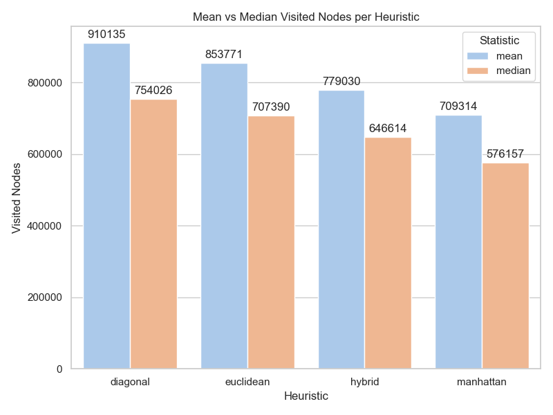

# A* Heuristics Evaluation

This project evaluates the performance of various heuristics for the A* pathfinding algorithm across different map scenarios. It includes CSV generation, data visualization, and HTML-based visual analysis.

---

## 📁 Project Structure

```
src/
├── astar.py                    # Core A* pathfinding algorithm
├── heuristics.py              # Heuristic functions (manhattan, euclidean, etc.)
├── gen_csv_astar.py          # Runs A* on scenarios, logs performance to CSV
├── gen_charts_astar.py       # Generates visual charts from CSVs
├── gen_html_astar_visualize.py # Creates heatmaps and HTML visualizations
```

---

## ⚙️ Requirements

Make sure you have Python 3.8+ and the following libraries installed:

```bash
pip install pandas matplotlib seaborn numpy
```

---

## 🚀 Usage

### 1. Generate CSV Evaluation Data

Run all A* evaluations for a given map and scenario file:

```bash
python src/gen_csv_astar.py
```

This produces a CSV file like: `results/csv/<map_name>_evaluation.csv`

### 2. Generate Summary Charts

```bash
python src/gen_charts_astar.py
```

Outputs:
- Mean/median time, visited nodes, path length
- Expected vs actual cost
- Time with error bars
- Combined metrics comparisons

Charts are saved in: `results/img/`

### 3. HTML Visualization (Optional)

To create HTML grid visualizations and heatmaps for a specific case:

```bash
python src/gen_html_astar_visualize.py
```

Output:
- Heatmap: `results/heatmap/<map>_<case>_<heuristic>.png`
- HTML grid: `results/htm/<map>_<case>_<heuristic>.html`

---

## 🧠 Heuristics Implemented

All located in `src/heuristics.py`:
- `manhattan(p1, p2)`
- `euclidean(p1, p2)`
- `diagonal(p1, p2)`
- `hybrid(p1, p2, w1=0.5, w2=0.5)`

You can add more and reference them in the configuration block inside `gen_csv_astar.py`.

---

## 📊 Output Metrics (per heuristic)

Each case generates:
- `expected_cost`: ground-truth path cost
- `actual_cost`: computed cost from A*
- `visited_nodes`: number of expanded nodes
- `path_length`: steps in the path
- `time_sec`: execution time
- `cost_error`: deviation from expected

---

## 📌 Notes

- All maps and scenarios should follow the [Moving AI Lab format](https://movingai.com/benchmarks/).
- Add your own maps to `./maps/`, and ensure `.map` and `.map.scen` files match.

---

## 🧪 Example Output

